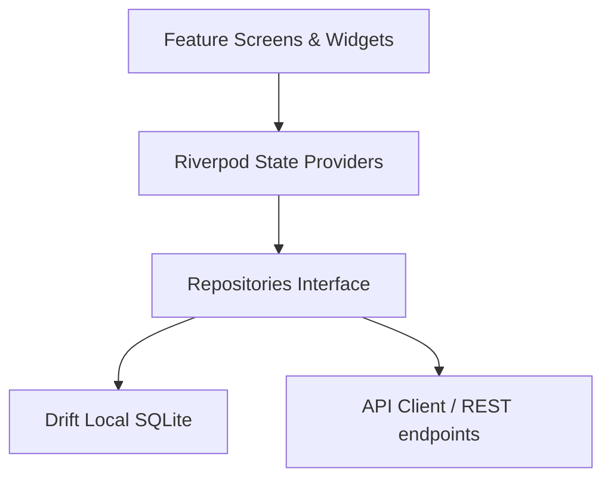

# ArchPharma Enterprise Application Architecture

This document describes the layered Clean Architecture pattern, data flows, offline synchronization, and security controls built into the ArchPharma system.

---

## Clean Architecture Layers

The codebase is organized into three primary layers inside the `lib/` directory:

### 1. Core Layer (`lib/core/`)
Holds cross-cutting, domain-independent tools and components:
- **Constants (`constants/`):** Unified application variables, asset keys, and hostname resolution guidelines.
- **Errors (`errors/`):** Structured, domain-specific custom exception classes.
- **Services (`services/`):** Logging infrastructure, centralized app router, and notification schedulers.
- **Theme (`theme/`):** Visual design system definitions (AppTheme, AppColors).
- **Widgets (`widgets/`):** A collection of highly standardized, reusable UI controls (AppButton, AppTextField, AppCard, AppDialog, AppTable, AppLoader).

### 2. Data Layer (`lib/data/`)
Encapsulates all external data management, schema definitions, and repositories:
- **Datasource (`datasource/`):** Implements local SQLite DB access via Drift (`AppDatabase`) and cloud API connectivity via Dio (`ApiClient`).
- **Models (`models/`):** Data model serializers and representation classes (Invoice, Product, Customer).
- **Repositories (`repositories/`):** Concrete implementations of repository boundaries. State managers call these repositories instead of interacting with databases or web servers directly.

### 3. Features Layer (`lib/features/`)
Contains all individual business-module screens, widgets, and state controllers:
- Each module represents a distinct visual feature of the app.
- Screens read state and notify changes through Riverpod providers.
- Feature providers depend exclusively on abstract repository objects injected via Riverpod providers.

---

## Data Flow & Authentication Architecture

### Authentication & Role Guards
- User sessions are tracked inside `authProvider`.
- Access credentials and JWT tokens are persisted securely in local memory using `FlutterSecureStorage`.
- The `appRouter` listens to `authProvider` state updates. If the user session is null, GoRouter forces a redirect to the login screen.
- Role-Based Access Control (RBAC) is monitored client-side and enforced server-side.

### Offline-First Database Sync
- Writes always occur in the local Drift SQLite database first, enabling the user to run transactions offline with zero network connection.
- Transactions are assigned client-generated UUIDs immediately.
- A background `SyncEngineNotifier` periodically pushes pending local records to NestJS REST API endpoints when internet connection is available, and pulls remote updates.
- If offline mode is toggled inside **System Settings**, cloud requests are deferred and stored safely in local drift queues.
